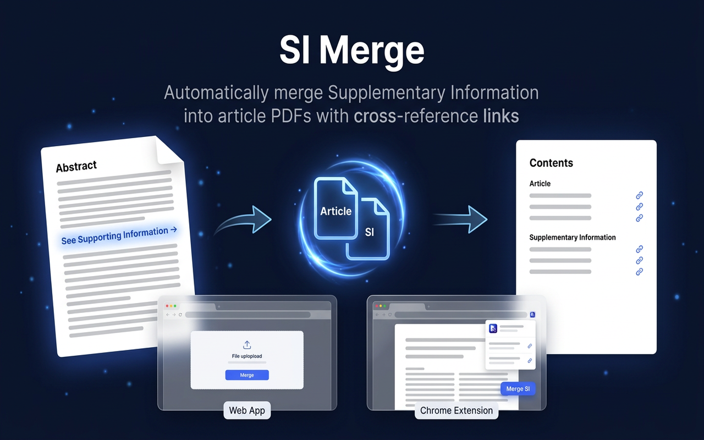
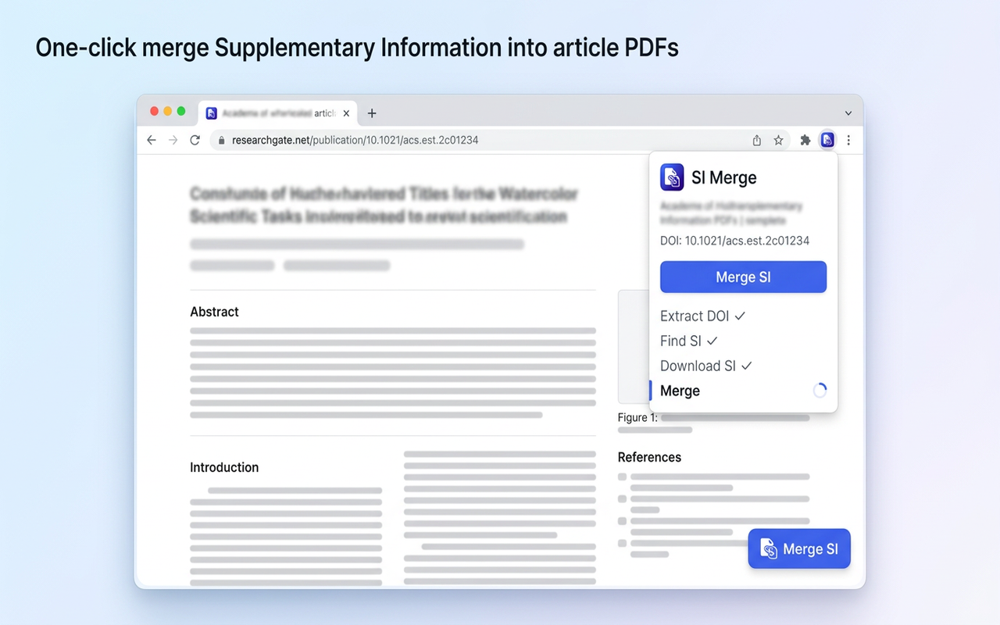

<p align="center">
  
</p>

<h1 align="center">SI Merge</h1>

<p align="center">
  <strong>Automatically find, download, and merge Supplementary Information into journal article PDFs — with bidirectional cross-reference links.</strong>
</p>

<p align="center">
  <a href="LICENSE"></a>
  <a href="https://www.python.org/"></a>
  <a href="https://fastapi.tiangolo.com/"></a>
  <a href="Dockerfile"></a>
  <a href="https://si-merge.onrender.com"></a>
  <a href="https://chrome.google.com/webstore"></a>
</p>

<p align="center">
  <a href="https://si-merge.onrender.com">Try the Web App</a> · <a href="#chrome-extension">Get the Extension</a> · <a href="#rest-api">API Docs</a>
</p>

---

## The Problem

Reading journal articles means constantly switching between the main paper and its Supplementary Information — separate files, separate windows, no linking. When the paper says *"see Figure S3"*, you have to manually open the SI PDF and scroll to find it.

## The Solution

**SI Merge** takes a journal article PDF and produces a single, self-contained document where every SI reference is a clickable link:

| Step | What happens |
|:----:|:-------------|
| **1** | **Extract DOI** from PDF metadata or text |
| **2** | **Find SI** by scraping the publisher's article page |
| **3** | **Download** supplementary files (PDF, DOCX, DOC) |
| **4** | **Convert** non-PDF formats using pure Python (no MS Office) |
| **5** | **Merge** SI into the article as a single PDF |
| **6** | **Create bidirectional cross-reference links** |

> **Forward links** (blue underline) — click *"Figure S1"* in the article → jump to the figure in SI
>
> **Back links** (orange underline) — click *"Supplementary Figure 1"* in the SI → jump back to where it was cited
>
> **Table of Contents** — navigable bookmarks for all SI figures and tables

---

## Supported Publishers

| Publisher | Journals | SI Formats | Status |
|:----------|:---------|:-----------|:-------|
| **Springer Nature** | Nature, Nat. Commun., Nat. Catal., ... | PDF | ✅ Fully automatic |
| **ACS** | JACS, ACS Catal., ACS Nano, ... | PDF | ✅ Fully automatic |
| **Wiley** | Angew. Chem., Adv. Mater., ... | PDF, DOCX | ✅ Fully automatic |
| **Elsevier** | Joule, Cell, Matter, ... | PDF | ✅ Fully automatic |
| **AAAS** | Science, Science Advances | PDF | ✅ Fully automatic |
| **PNAS** | PNAS | PDF | ✅ Fully automatic |
| **RSC** | EES, JMCA, Chem. Sci., ... | PDF | ✅ Fully automatic |
| **APS** | PRL, PRB, PRX, ... | PDF | ⚠️ Manual SI required |
| **Taylor & Francis** | Various | PDF | 🔄 Generic scraper fallback |

---

## Quick Start

### Chrome Extension

> One-click merge directly from any publisher's article page.

<p align="center">
  
</p>

1. Open `chrome://extensions` → enable **Developer mode**
2. Click **Load unpacked** → select the `extension/` folder
3. Navigate to any supported publisher's article page
4. Click the floating **Merge SI** button or use the extension popup

The extension auto-detects the DOI, downloads the PDF using your institutional access, merges SI via the backend, and downloads the result — all in one click.

> **Safari:** Convert with `xcrun safari-web-extension-converter extension/` (requires Xcode).

---

### Web App

**Live instance:** [si-merge.onrender.com](https://si-merge.onrender.com)

```bash
# With Docker (recommended)
docker compose up --build
# Open http://localhost:8000

# Without Docker
python3 -m venv venv && source venv/bin/activate
pip install -r requirements.txt
uvicorn app:app --port 8000
```

Features:
- **Drag & drop** single or multiple PDFs
- **Real-time progress** via Server-Sent Events (6-step pipeline)
- **Batch processing** with per-file results
- **Manual SI options** — paste SI URLs or upload files when auto-discovery fails
- **Contextual error guidance** when publisher blocks access

---

### Command Line

```bash
# Basic — auto-detect DOI, find SI, merge
python si_merge.py article.pdf

# Specify output
python si_merge.py article.pdf -o merged.pdf

# Override DOI
python si_merge.py article.pdf --doi 10.1038/s41467-023-44674-1

# Manual SI URL (when auto-discovery is blocked)
python si_merge.py article.pdf --si-url https://example.com/si.pdf

# Manual SI file
python si_merge.py article.pdf --si-file ~/Downloads/supplemental.pdf

# Batch processing
python si_merge.py paper1.pdf paper2.pdf paper3.pdf
python si_merge.py ./papers/                 # entire directory
python si_merge.py ./papers/ -o ./merged/
```

### Python Library

```python
from si_merge import run_merge, run_batch_merge

result = run_merge(
    pdf_path="article.pdf",
    on_progress=lambda step, status, detail: print(f"[{step}] {status}: {detail}")
)
print(f"Output: {result.output_path}")
print(f"Links: {result.forward_links} forward, {result.back_links} back")

# Batch
batch = run_batch_merge(["paper1.pdf", "paper2.pdf"], output_dir="./merged/")
print(f"{batch.succeeded}/{batch.total} succeeded")
```

---

## Architecture

```
┌──────────────────────────────────────────────────────────┐
│                     Chrome Extension                      │
│  ┌─────────┐  ┌────────────┐  ┌────────────────────────┐ │
│  │ Content  │  │  Service   │  │  Popup UI              │ │
│  │ Script   │──│  Worker    │──│  (DOI, progress, DL)   │ │
│  │ (detect  │  │  (hybrid   │  └────────────────────────┘ │
│  │  + FAB)  │  │  PDF DL)   │                             │
│  └─────────┘  └─────┬──────┘                              │
└─────────────────────┼────────────────────────────────────┘
                      │ Upload PDF / merge-by-doi
┌─────────────────────┼────────────────────────────────────┐
│                     ▼           Web Browser               │
│           (drag & drop upload, real-time progress)        │
└──────────────┬───────────────────────────┬───────────────┘
               │ Upload PDF                │ SSE events
               ▼                           ▲
┌──────────────────────────────────────────────────────────┐
│                    FastAPI  (app.py)                       │
│  ┌──────────┐ ┌───────────┐ ┌──────────┐ ┌───────────┐  │
│  │ /api/    │ │ /api/     │ │ /api/    │ │ /api/     │  │
│  │ tasks    │ │ batch     │ │merge-doi │ │ health    │  │
│  └────┬─────┘ └─────┬─────┘ └────┬─────┘ └───────────┘  │
│       └─────────────┼────────────┘                        │
│                     ▼                                     │
│  ┌─────────────────────────────────────┐                  │
│  │       TaskStore  (in-memory)        │                  │
│  │  task state · events · file paths   │                  │
│  └─────────────────────────────────────┘                  │
└──────────────────────┬───────────────────────────────────┘
                       │ Background Thread
                       ▼
┌──────────────────────────────────────────────────────────┐
│                  si_merge.py  (core)                       │
│                                                           │
│  ① Extract DOI ──▶ ② Find SI ──▶ ③ Download SI           │
│       (PyMuPDF)      (scrape)      (curl_cffi)            │
│                                        │                  │
│  ⑥ Merge & Link ◀── ⑤ Analyze ◀── ④ Extract text         │
│     (PyMuPDF)         (regex)      (PyMuPDF / OCR)        │
│                                                           │
│  Publisher Scrapers:                                      │
│  Nature · ACS · Wiley · Elsevier · PNAS · Science · RSC  │
└──────────────────────────────────────────────────────────┘
```

---

## Chrome Extension

The Chrome extension provides the most seamless experience — merge SI without leaving the article page.

**How it works:**

1. Visit an article page → extension detects the DOI from page metadata
2. A floating **Merge SI** button appears in the bottom-right corner
3. Click it → the extension downloads the article PDF using your browser session (institutional access works), sends it to the backend, and triggers a download of the merged result

**Key features:**

- 🔍 Auto-detects DOI & PDF URL from `<meta>` tags
- 🔐 **Hybrid download strategy** — page-context fetch (bypasses Cloudflare, uses your cookies) → service worker fetch → server-side fallback
- 📝 Popup UI with manual DOI input
- ⚙️ Configurable backend URL (public instance or self-hosted)
- 📊 Real-time 6-step progress on the floating button and popup

---

## REST API

| Method | Endpoint | Description |
|:------:|:---------|:------------|
| `GET` | `/api/health` | Health check |
| `POST` | `/api/tasks` | Create async merge task (single file) |
| `POST` | `/api/batch` | Create async batch merge task |
| `GET` | `/api/tasks/{id}` | Get task status |
| `GET` | `/api/tasks/{id}/events` | SSE progress stream |
| `GET` | `/api/tasks/{id}/download` | Download merged PDF |
| `GET` | `/api/tasks/{id}/download/{idx}` | Download file from batch |
| `POST` | `/api/merge` | Synchronous merge (upload → merged PDF) |
| `POST` | `/api/merge-by-doi` | Merge by DOI (server downloads article) |

Interactive docs: [`/docs`](https://si-merge.onrender.com/docs)

---

## Deployment

The app ships as a Docker container deployable to any platform.

| Platform | Setup | Free Tier |
|:---------|:------|:----------|
| [**Render**](https://render.com) | Connect GitHub → auto-detect Dockerfile | 750 h/month |
| [**Railway**](https://railway.app) | Connect GitHub → auto-deploy | $5/month credit |
| [**Fly.io**](https://fly.io) | `fly launch && fly deploy` | 3 shared VMs |
| [**Google Cloud Run**](https://cloud.google.com/run) | Build trigger from GitHub | 2M req/month |

> **Note:** Cloudflare Pages/Workers is not supported — this project requires a full Python runtime with native C libraries (Cairo, Pango, MuPDF), file system access, and long-running background tasks.

### Environment Variables

| Variable | Default | Description |
|:---------|:--------|:------------|
| `SI_MERGE_MAX_UPLOAD_MB` | `50` | Maximum upload file size |
| `SI_MERGE_TASK_TTL` | `3600` | Seconds before completed tasks are cleaned up |

---

## Technical Details

<details>
<summary><strong>Text Extraction Strategy</strong></summary>

SI references like *"Figure S3"* must be located precisely in the PDF. The tool uses a cascading approach:

1. **Direct extraction** via PyMuPDF — works for most well-formed PDFs
2. **Re-download** from the publisher — fixes corrupted or truncated local copies
3. **OCR fallback** — renders pages to images and runs Tesseract (for scanned PDFs)

</details>

<details>
<summary><strong>Document Format Conversion</strong></summary>

Non-PDF SI files (DOCX, DOC) are converted automatically:

1. **mammoth + WeasyPrint** — pure Python, no external software. Primary strategy for DOCX.
2. **LibreOffice headless** — fallback for DOC files or when the above fails.

</details>

<details>
<summary><strong>Cross-Reference Linking</strong></summary>

Regex pattern matching finds SI references in article text (e.g., *"Figure S1"*, *"Table S2"*, *"Supplementary Note 3"*) and corresponding anchors in the SI. Links are PDF annotations with colored underlines (blue = forward, orange = back), organized into a bookmark tree.

</details>

<details>
<summary><strong>HTTP Client & Anti-Bot Bypass</strong></summary>

Publisher websites often employ anti-bot measures. The tool uses:
- **curl_cffi** with browser-like TLS fingerprinting to bypass Cloudflare
- Persistent sessions with cookies and Referer headers
- Publisher-specific scraping strategies
- The Chrome extension uses `chrome.scripting.executeScript` in the page's MAIN world to leverage the user's browser session

</details>

---

## Installation

**Requirements:**
- Python 3.10+
- System libraries for WeasyPrint: Cairo, Pango, GDK-Pixbuf (bundled in Docker)
- *(Optional)* Tesseract OCR — for scanned PDFs
- *(Optional)* LibreOffice — for DOC format conversion

```bash
# Local setup
python3 -m venv venv && source venv/bin/activate
pip install -r requirements.txt

# macOS system dependencies
brew install cairo pango gdk-pixbuf libffi
brew install tesseract    # optional

# Or just use Docker
docker compose up --build
# → http://localhost:8000
```

---

## Contributing

See [CONTRIBUTING.md](CONTRIBUTING.md) for development setup, adding publisher support, and code style guidelines.

## License

[MIT](LICENSE) — free for academic and commercial use.
